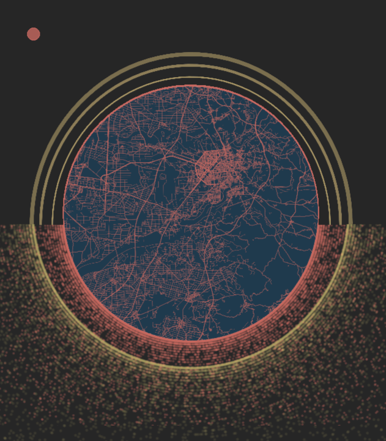

# Celestial-style Map

This is the R code for the celestial-style map of Chiayi (Jiayi), Taiwan, from my Twitter post.

I used R's osmdata library for the map, along with ggplot, cowplot, and magick to make it pretty. I saved the preliminary parts onto my own computer, so please be sure to change the filepath to your own if trying to make your own map.

